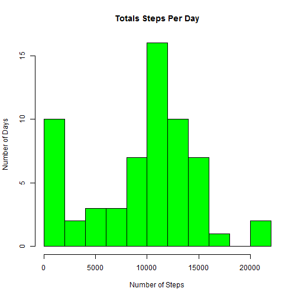
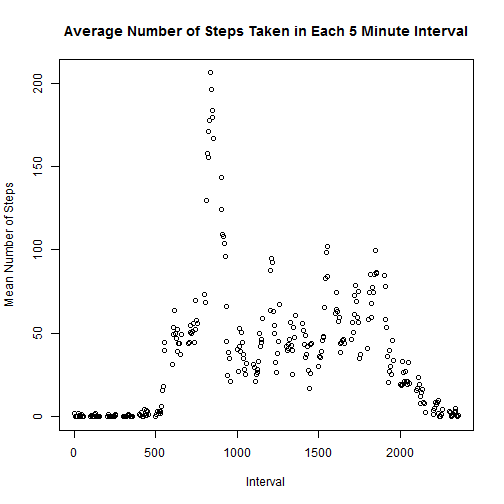
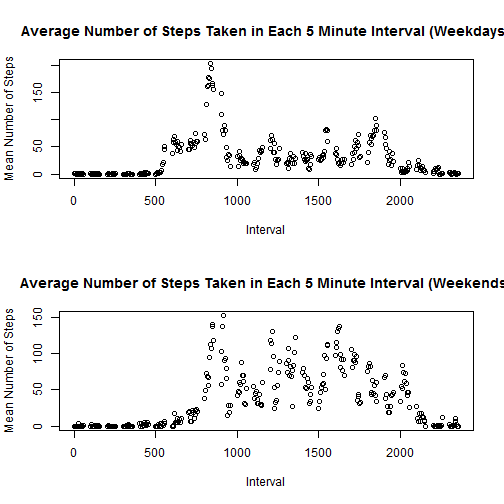

This document answers all questions assigned in the first course project for the Reproducible Research Coursera course

**Loading and preprocessing the data**

This code reads in the data:


```r
activity<-read.csv("activity.csv")
```

**What is the mean total number of steps taken per day?**

This code calculates the total number of steps per day:


```r
total.steps<-tapply(activity$steps, activity$date, sum, na.rm=TRUE)
total.steps<-as.data.frame(total.steps)
total.steps
```

```
##            total.steps
## 2012-10-01           0
## 2012-10-02         126
## 2012-10-03       11352
## 2012-10-04       12116
## 2012-10-05       13294
## 2012-10-06       15420
## 2012-10-07       11015
## 2012-10-08           0
## 2012-10-09       12811
## 2012-10-10        9900
## 2012-10-11       10304
## 2012-10-12       17382
## 2012-10-13       12426
## 2012-10-14       15098
## 2012-10-15       10139
## 2012-10-16       15084
## 2012-10-17       13452
## 2012-10-18       10056
## 2012-10-19       11829
## 2012-10-20       10395
## 2012-10-21        8821
## 2012-10-22       13460
## 2012-10-23        8918
## 2012-10-24        8355
## 2012-10-25        2492
## 2012-10-26        6778
## 2012-10-27       10119
## 2012-10-28       11458
## 2012-10-29        5018
## 2012-10-30        9819
## 2012-10-31       15414
## 2012-11-01           0
## 2012-11-02       10600
## 2012-11-03       10571
## 2012-11-04           0
## 2012-11-05       10439
## 2012-11-06        8334
## 2012-11-07       12883
## 2012-11-08        3219
## 2012-11-09           0
## 2012-11-10           0
## 2012-11-11       12608
## 2012-11-12       10765
## 2012-11-13        7336
## 2012-11-14           0
## 2012-11-15          41
## 2012-11-16        5441
## 2012-11-17       14339
## 2012-11-18       15110
## 2012-11-19        8841
## 2012-11-20        4472
## 2012-11-21       12787
## 2012-11-22       20427
## 2012-11-23       21194
## 2012-11-24       14478
## 2012-11-25       11834
## 2012-11-26       11162
## 2012-11-27       13646
## 2012-11-28       10183
## 2012-11-29        7047
## 2012-11-30           0
```

This code creates a histogram of the total number of steps per day:


```r
hist(total.steps$total.steps,xlab="Number of Steps",ylab="Number of Days",
     main="Totals Steps Per Day",breaks=10,col="green")
```

 

This code calculates the mean and median of the total number of steps per day:


```r
#Mean
mean(total.steps$total.steps)
```

```
## [1] 9354.23
```

```r
#Median
median(total.steps$total.steps)
```

```
## [1] 10395
```

**What is the average daily activity pattern?**

This codes constructs a plot of the average number of steps taken during each interval:


```r
mean.steps.interval<-tapply(activity$steps, activity$interval, mean, na.rm=TRUE)
activity1<-data.frame(activity$interval[1:288],mean.steps.interval)
plot(activity1,xlab="Interval",ylab="Mean Number of Steps",
     main="Average Number of Steps Taken in Each 5 Minute Interval")
```

 

This code finds the interval during which the maximum average number of steps occurs:


```r
#Output contains interval followed by position in data frame
which.max(mean.steps.interval)
```

```
## 835 
## 104
```

**Imputing missing values**

This code calculates the number of missing values in the dataset:


```r
sum(is.na(activity$steps))
```

```
## [1] 2304
```

This code fills in the missing values for each day with the average number of steps taken that day:


```r
mean.per.day<-tapply(activity$steps, activity$date, mean)
mean.per.day[is.na(mean.per.day)]<-0
replace<-rep(mean.per.day, each=288)
activity$steps[is.na(activity$steps)] <- replace[is.na(activity$steps)]
```

This code creates a histogram and calculates the mean and median of the total number of steps per day adjusted for the missing values:


```r
total.steps<-tapply(activity$steps, activity$date, sum, na.rm=TRUE)
total.steps<-as.data.frame(total.steps)
hist(total.steps$total.steps,xlab="Number of Steps",ylab="Number of Days",
     main="Totals Steps Per Day",breaks=10,col="green")
```

 

```r
#Mean
mean(total.steps$total.steps)
```

```
## [1] 9354.23
```

```r
#Median
median(total.steps$total.steps)
```

```
## [1] 10395
```

This method of imputing the missing data has no effect of the estimates made earlier in the assignment.

**Are there differences in activity patterns between weekdays and weekends?**

This code assigns each day of activity as either a weekday or weekend:


```r
activity$day<-weekdays(as.Date(activity$date))
activity$day.type<-ifelse(activity$day == "Saturday"|activity$day == "Sunday",
                          "Weekend", "Weekday")
```

This codes constructs a plot of the average number of steps taken during each interval, separated by weekday and weekend:


```r
par(mfrow=c(2,1))
activity.weekday<-subset(activity,activity$day.type=="Weekday")
mean.steps.weekday<-tapply(activity.weekday$steps, activity.weekday$interval, mean)
activity1.weekday<-data.frame(activity$interval[1:288],mean.steps.weekday)
plot(activity1.weekday,xlab="Interval",ylab="Mean Number of Steps",
     main="Average Number of Steps Taken in Each 5 Minute Interval (Weekdays)")
activity.weekend<-subset(activity,activity$day.type=="Weekend")
mean.steps.weekend<-tapply(activity.weekend$steps, activity.weekend$interval, mean)
activity1.weekend<-data.frame(activity$interval[1:288],mean.steps.weekend)
plot(activity1.weekend,xlab="Interval",ylab="Mean Number of Steps",
     main="Average Number of Steps Taken in Each 5 Minute Interval (Weekends)")
```

 
